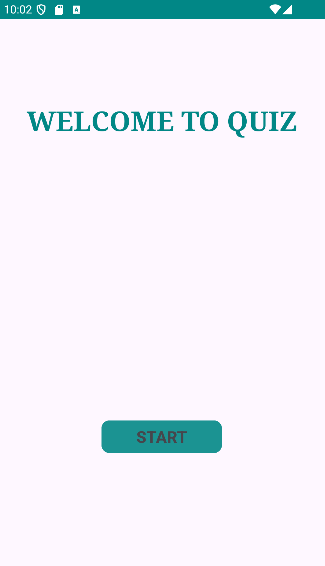
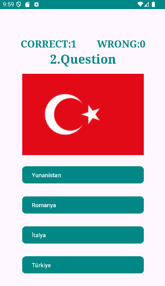

# Flag Quiz Application

## Project Description
The **Flag Quiz Application** is an Android-based quiz game where users are presented with 5 multiple-choice questions about country flags. Each question displays a randomly selected flag image along with 5 possible country names (1 correct and 4 incorrect choices). The objective is to test and improve users' knowledge of world flags while demonstrating database interaction skills.

## Features
- Random selection of 5 flag images from a database
- Each question includes 1 correct answer and 4 incorrect options
- Users answer 5 questions per session
- At the end of the quiz, the application displays:
  - Number of correct answers
  - Number of incorrect answers
  - Success percentage

## Technologies Used
- **Kotlin** for Android development
- **SQLite** for storing flag images and country names
- **Android Studio** for development and debugging

## How It Works
1. The application fetches 5 random flag images from the database.
2. For each flag, 4 incorrect country names and 1 correct country name are retrieved from the database.
3. The user selects an answer from the multiple-choice options.
4. The quiz continues for 5 rounds.
5. At the end, the user's performance is evaluated and displayed.

## Screenshots
   

## Installation & Setup
1. Clone the repository:
   ```sh
   git clone https://github.com/AzizEkren/FlagQuizApp
